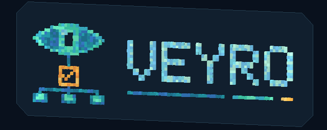
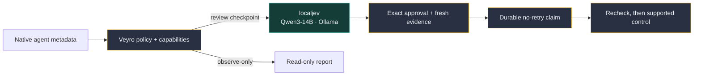

<p align="center">
  
</p>
<p align="center"><a href="docs/assets/veyro-logo-animated-poster.png">Static logo</a></p>

<h1 align="center">Veyro</h1>
<p align="center"><strong>Local agent supervision with localjev and Qwen3-14B.</strong></p>
<p align="center">Keep your coding agent. Run its semantic assessor on your own machine.</p>
<p align="center">
  <a href="docs/localjev.md">localjev setup</a> ·
  <a href="examples/README.md">Run an assessment</a> ·
  <a href="docs/supervision-operator-guide.md">Operator guide</a> ·
  <a href="docs/supervision-reference.md">Capabilities</a>
</p>

Veyro observes Prime Agent, OpenCode, and Codex hook metadata. At review checkpoints,
[localjev](https://github.com/githubnext/localjev) asks **Qwen3-14B** whether the
session is making progress, has enough verification, or needs a person.
Deterministic policy decides what can happen next. Model scores cannot grant permission.

Your agent keeps its native terminal, tools, and permission system. Veyro uses
structured events, not terminal scraping.

## Qwen3-14B is the assessor

| Component | Veyro's configured baseline |
| --- | --- |
| Local decision API | **localjev**, `http://127.0.0.1:8080` |
| Inference backend | **Ollama**, `http://127.0.0.1:11434` |
| Underlying model | **Qwen3-14B**, Ollama tag `qwen3:14b` |
| Weight format | `Q4_K_M` GGUF, 14.8B parameters |
| Provider identity | `localjev-qwen3-14b` |
| SDK request alias | `jev-latest`, not the weight/model name |

The [baseline manifest](config/baselines/localjev-qwen3-14b.json) records the exact
weight digest and tested service settings. The [deployment guide](docs/localjev.md)
explains how to check them. localjev returns model-generated probability estimates,
not calibrated guarantees or direct token-logit measurements. The checkpoint label
records configuration; it does not attest the weights used for each response.

There is one authoritative assessor. No cloud fallback, alternate-model routing,
or shadow voting participates in the existing-session control plane. Native coding
agents can still use their own remote services.

## Run a real local assessment

From a checkout, install Python 3.11+ dependencies with [uv](https://docs.astral.sh/uv/):

```sh
git clone https://github.com/pkmdev-sec/veyro.git
cd veyro
uv venv --python 3.12
uv pip install --python .venv/bin/python --editable '.[dev]'

# Inspect the synthetic failed-test checkpoint. No service is needed.
.venv/bin/python examples/assess_localjev.py

# With the Qwen3-14B localjev deployment running, request real model scores.
.venv/bin/python examples/assess_localjev.py --live
```

The example uses Veyro's actual checkpoint reducer and pinned assessor. It sends
only the checked-in [failed-test fixture](examples/failed-verification.json).
It never connects to an agent or delivers a control. [Set up localjev first](docs/localjev.md).
Veyro does not install a model or start an inference server for you.

The response includes seven named scores, configured model provenance, and
`controls_enabled: false`. A failed test does not become a completion claim just
because the native agent stopped talking. See the [example walkthrough](examples/README.md).

## From observation to an approved action



**Observe-only is the default.** `sessions` and `attach` do not call localjev or
send prompts. `supervise` evaluates one operator proposal, not an unattended
stream of agent-generated actions. Advisory mode can assess but never deliver.
Forbidden operations stop before model review. No pinned native adapter currently
qualifies for automatic delivery.

| Provider | Version | Observation | `supervise` control support |
| --- | --- | --- | --- |
| Prime Agent | `0.9.5` | Live daemon metadata; partial history | Approved follow-up, steer, interrupt, stop; subject to observed state |
| OpenCode | `1.18.30` | Authenticated HTTP/SSE; no replay | Approved follow-up, observed approval reply, interrupt |
| Codex | `0.154.0` | Local hook journal; native liveness unknown | Observation-only in this CLI |

Use the [operator guide](docs/supervision-operator-guide.md) to select an existing
session and supply its real repository and endpoint. The
[capability matrix](docs/supervision-reference.md#adapter-capabilities) distinguishes
implemented operations from permission to execute them. Pi and Claude Code support
[native launch](docs/agent-router.md), not existing-session supervision.

## Safety boundaries

- Native permissions still apply. Veyro gates its own controls, not every native tool action.
- Approvals bind to the full request. Changed observations or expired approval block dispatch.
- Durable claims prevent duplicate dispatch across reconnects. Keep them after uncertainty.
- History is partial. A queue receipt or clean exit does not prove task completion.
- Normalized evidence omits transcripts, tool arguments/output, and credentials. Paths and IDs remain sensitive.
- The separate factory loop can log task text and agent output. It has a different privacy contract.

Read [privacy and retention](docs/supervision-reference.md#privacy-and-retention)
before connecting to a real session. Capability support is version-pinned, not a
promise that any installed release will work.

## Repository guide

| Path | Purpose |
| --- | --- |
| [`examples/`](examples/README.md) | Runnable localjev assessment using synthetic metadata |
| [`config/baselines/localjev-qwen3-14b.json`](config/baselines/localjev-qwen3-14b.json) | Exact model identity and recorded deployment settings |
| [`src/veyro/bridges/`](src/veyro/bridges/) | Native provider adapters |
| [`src/veyro/supervision/`](src/veyro/supervision/) | State reduction, checkpoints, authorization, delivery |
| [`docs/`](docs/README.md) | Deployment, operation, architecture, and verification |
| [`tests/`](tests/) | Contract, privacy, replay, approval, and packaging checks |

The CLI/import package is `veyro`; the distribution is `veyro-factory`.
See [upgrade notes](docs/upgrading.md) for existing installations and journals.
The separate [factory runtime](docs/runtime.md) defaults to:

| Factory setting | Default | Purpose |
| --- | --- | --- |
| `VEYRO_CODEX_BACKEND` | `exec` | `app-server` is an explicit experimental steering opt-in. |

## Verify your installation

```sh
.venv/bin/python -m pytest -q
.venv/bin/ruff check src tests tools examples
uv build --offline
```

[Verification procedures and evidence](docs/supervision-verification.md) cover
native observation, one approved disposable Prime stop, and Codex hook delivery.
They do not establish general task accuracy or automatic control safety.
The known `test_noisy_events_are_coalesced` timing failure is documented, not suppressed.

[MIT license](LICENSE) · [Architecture](docs/theory.md) · [Evidence limits](docs/what-veyro-proves.md)
