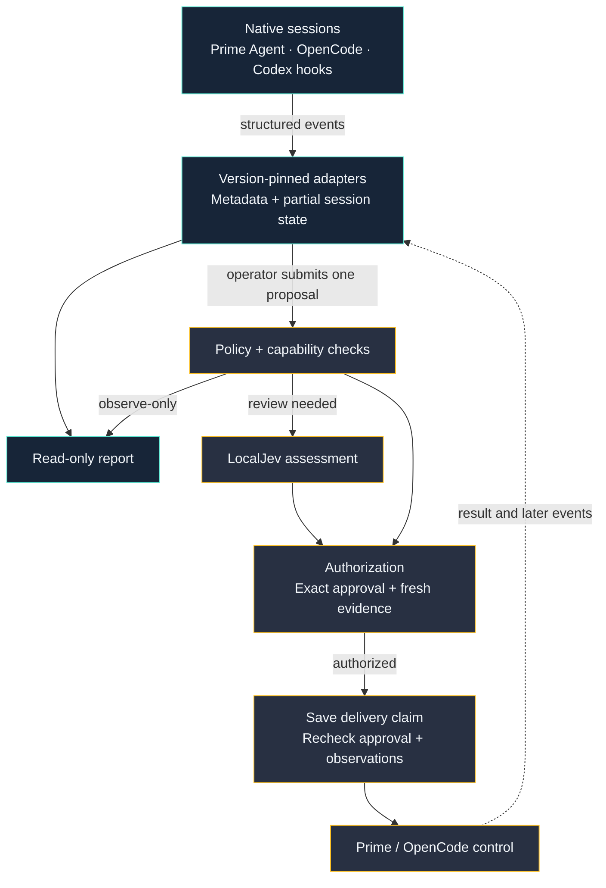

<p align="center">
  
</p>

<h1 align="center">Veyro</h1>
<p align="center">Supervise coding agents without replacing their native tools.</p>
<p align="center">
  <a href="docs/supervision-operator-guide.md">Operator guide</a> ·
  <a href="docs/supervision-reference.md">Capabilities</a> ·
  <a href="docs/supervision-verification.md">Verification</a>
</p>

Veyro observes existing agent sessions, keeps structured metadata, and checks
control proposals against policy. You keep the native terminal and permission
system. Veyro does not scrape terminal output.

> [!IMPORTANT]
> The default is **observe-only**. No current native adapter qualifies for
> automatic delivery. Controls need approval, and unsupported controls stay blocked.

The CLI is still `foreman`. The Python distribution is `foreman-factory`.

## What it does

| Feature | What you get |
| --- | --- |
| Read-only attachment | Find and observe existing sessions without starting or resuming them. |
| Provider adapters | Version-pinned Prime Agent, OpenCode, and Codex hook integration. |
| Policy first | Check declared operations and capabilities before semantic review. |
| Local assessment | Use LocalJev with the configured Qwen3 checkpoint at meaningful checkpoints. No fallback assessor. |
| Exact approval | Bind approval to the selected session, command, and complete request. |
| Fresh evidence | Recheck observations and approval time before delivery. |
| Duplicate protection | Save a durable claim before dispatch. Do not blindly retry uncertain delivery. |

## How it works



This diagram shows the existing-session CLI. Codex is observation-only here.
Forbidden operations stop before model review. Advisory mode can assess but never
deliver. The CLI evaluates one proposal; it is not an unattended agent.

## Provider support

| Provider | Version | Observation | Control through `supervise` |
| --- | --- | --- | --- |
| Prime Agent | `0.9.5` | Live daemon events; partial history | Approved follow-up, steer, interrupt, or stop, subject to observed state |
| OpenCode | `1.18.30` | Authenticated HTTP/SSE; no replay | Approved follow-up, observed approval reply, or interrupt |
| Codex | `0.154.0` | Local hook journals; native liveness unknown | Not exposed; the opt-in queue adapter has no live delivery proof |

The [full matrix](docs/supervision-reference.md#adapter-capabilities) separates
capability support from permission to act. Pi and Claude Code are outside this
supervision roadmap. Their native launch support is unchanged.

## Try read-only observation

Use Python 3.11 or later and [uv](https://docs.astral.sh/uv/). From a checkout:

```sh
uv venv --python 3.12
uv pip install --python .venv/bin/python --editable '.[dev]'
```

Choose an existing Prime session. Use its real repository and daemon socket:

```sh
.venv/bin/foreman sessions --agent prime-agent --repo /path/to/repo \
  --socket /path/to/existing/daemon.sock

.venv/bin/foreman attach --agent prime-agent --repo /path/to/repo \
  --socket /path/to/existing/daemon.sock --session ACTIVE_ID --watch-seconds 30
```

Copy `ACTIVE_ID` from discovery. These commands send no prompts or controls and do
not need LocalJev. See the [operator guide](docs/supervision-operator-guide.md) for
OpenCode credentials, Codex hooks, proposal files, and the approval stdin protocol.

## Safety limits

- History is partial. A clean exit or a queue receipt does not prove task completion.
- Gates cover Veyro-issued controls, not every native tool action. Keep native permissions enabled.
- Normalized evidence omits content and credentials. Paths, IDs, and digests can still be sensitive.
- Native content can enter adapter memory before filtering. Native storage follows provider policy.
- The Qwen checkpoint is a configured identity, not per-response weight attestation. [Check the deployment](docs/supervision-verification.md#check-the-assessor-deployment).
- Preserve delivery claims after a timeout or disconnect. Inspect the native session before any new action.

## Other interfaces

`foreman agent` launches a native interface with a lifecycle/workspace sidecar.
`foreman run` is the separate legacy factory loop. Its logs can contain task text
and agent output; it does not share the metadata-only privacy contract above.

| Legacy setting | Default | Purpose |
| --- | --- | --- |
| `FOREMAN_CODEX_BACKEND` | `exec` | Explicit `app-server` opt-in enables experimental steering. |

See [native routing](docs/agent-router.md) and [factory runtime](docs/runtime.md).
The [proposed product charter](docs/product-charter.md) describes future scope,
not a list of shipped features.

## Verify

```sh
.venv/bin/python -m pytest -q
.venv/bin/ruff check src tests
.venv/bin/python tools/generate_brand_assets.py --check
```

[Recorded native checks](docs/supervision-verification.md) cover Prime observation
and approved stop, OpenCode observation, and Codex hook delivery. They do not prove
live automatic control, OpenCode control delivery, or Codex queue execution.
The known `test_noisy_events_are_coalesced` timing failure is documented there.

[SVG logo](docs/assets/veyro-logo.svg) · [PNG logo](docs/assets/veyro-logo.png) · [MIT license](LICENSE)
