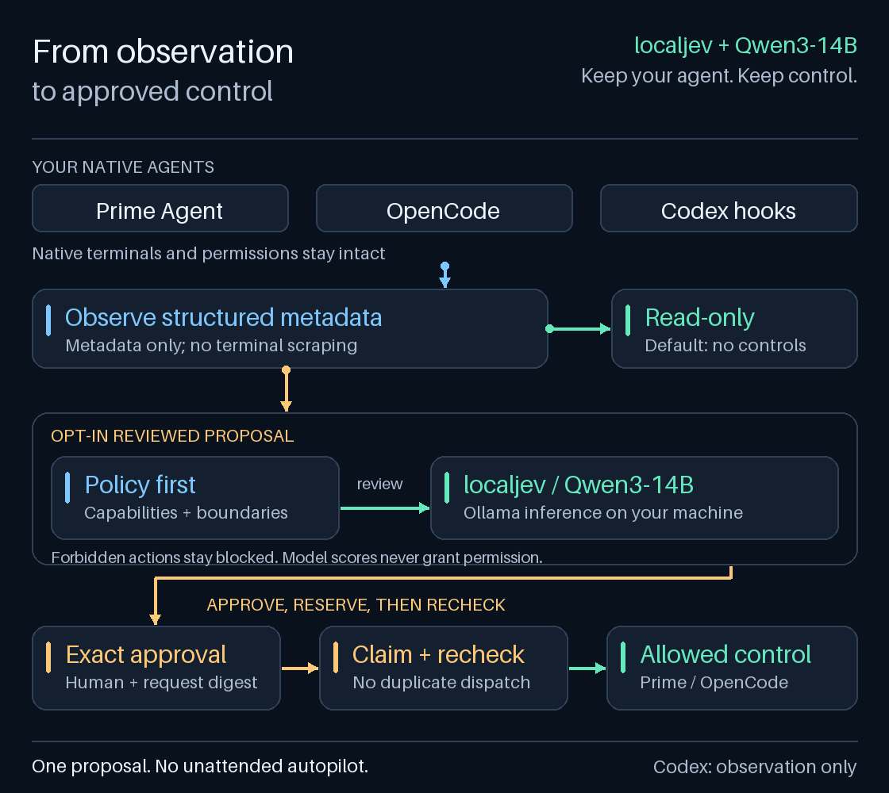
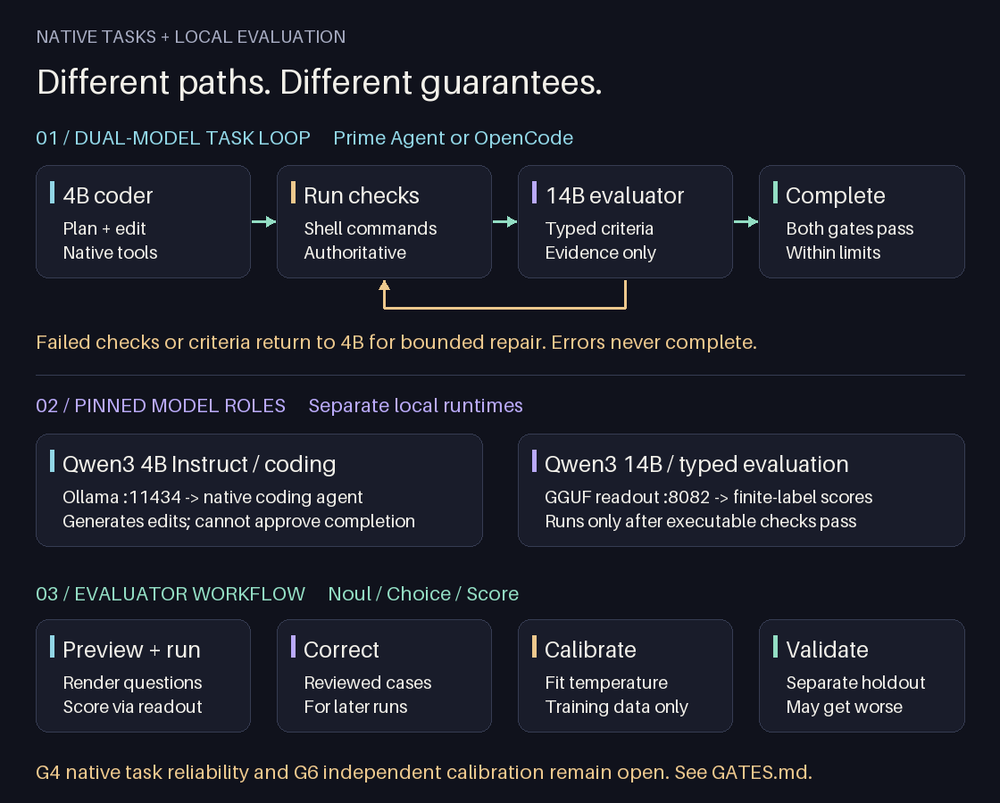

<p align="center">
  
</p>

<h1 align="center">Veyro</h1>
<p align="center"><strong>Native coding agents. Local assessment. Explicit checks.</strong></p>
<p align="center">Keep your terminal and permissions. Choose observation, checked tasks, or typed evaluation.</p>
<p align="center">
  <a href="docs/localjev.md">localjev setup</a> ·
  <a href="examples/README.md">Run an assessment</a> ·
  <a href="docs/supervision-operator-guide.md">Operator guide</a> ·
  <a href="docs/supervision-reference.md">Capabilities</a>
</p>

Veyro observes Prime Agent, OpenCode, and Codex hook metadata. At review checkpoints,
[localjev](https://github.com/githubnext/localjev) asks **Qwen3-14B** whether the
session is making progress, has enough verification, or needs a person.
Deterministic policy decides what can happen next. Model scores cannot grant permission.

Your agent keeps its native terminal, tools, and permission system. Veyro uses
structured events, not terminal scraping.

## Current status

> **Production qualification is incomplete.** [GATES.md](GATES.md) is the release ledger.
> G4 remains open: native task runs do not pass across both CLIs and both local profiles.
> G6 remains open: calibration lacks an independent workflow-labelled holdout.
> Passing unit tests and building a package do not close these gates.

## How it works

Choose the interface that matches your task. Each has a different control and privacy boundary.

| Goal | Commands | Boundary |
| --- | --- | --- |
| Keep a native terminal | `agents`, `agent` | Launch an installed agent with lifecycle observation |
| Inspect an existing session | `sessions`, `attach` | Read-only metadata; no model call or control |
| Review one proposed action | `supervise` | Policy, localjev assessment, then exact approval for supported controls |
| Run a checked task | `agent --autonomous` | Prime Agent or OpenCode; bounded repair loop; native permissions remain |
| Score typed questions locally | `local`, `evaluator` | Experimental GGUF readout, corrections, and temperature calibration |
| Run the separate worker harness | `run`, `demo`, `runs`, `inspect` | Factory state, worker events, and its own content-bearing logs |

### Existing-session review

The diagram shows `supervise`, not the autonomous task loop. Observation is read-only.
For an approved control, Veyro checks policy, requests local assessment, binds human
approval to the exact request, records a dispatch claim, and rechecks freshness.

<p align="center">
  
</p>

[Open the still diagram](docs/assets/veyro-supervision.png) if you prefer no animation.

## Qwen3-14B is the assessor

| Component | Veyro's configured baseline |
| --- | --- |
| Local decision API | **localjev**, `http://127.0.0.1:8080` |
| Inference backend | **Ollama**, `http://127.0.0.1:11434` |
| Underlying model | **Qwen3-14B**, Ollama tag `qwen3:14b` |
| Weight format | `Q4_K_M` GGUF, 14.8B parameters |
| Provider identity | `localjev-qwen3-14b` |
| SDK request alias | `jev-latest`, not the weight/model name |

The [baseline manifest](config/baselines/localjev-qwen3-14b.json) records the exact
weight digest and tested service settings. The [deployment guide](docs/localjev.md)
explains how to check them. localjev returns model-generated probability estimates,
not calibrated guarantees or direct token-logit measurements. The checkpoint label
records configuration; it does not attest the weights used for each response.

### Qwen model variants

| Variant | Size and format | Role | Availability |
| --- | --- | --- | --- |
| **Qwen3 14B** (`qwen3:14b`) | 14.8B parameters, Q4_K_M | Existing-session localjev assessment and typed evaluation after checks | Included; G6 calibration remains open |
| **Qwen3 4B Instruct** (`qwen3:4b-instruct-2507-q4_K_M`) | 4.0B parameters, Q4_K_M | Lower-memory local coding through Prime Agent or OpenCode | Included; G4 native-task qualification remains open |

The sizes have distinct roles. Existing-session supervision stays pinned to **14B**.
The autonomous task path uses **4B** for coding and **14B** for typed evaluation.
This split does not establish reliable autonomous completion or calibrated probabilities.
See [model roles and limits](docs/qwen-models.md).

For existing-session supervision, there is one authoritative assessor. No cloud fallback, alternate-model routing,
or shadow voting participates in the existing-session control plane. Native coding
agents can still use their own remote services.

## Run a real local assessment

From a checkout, install Python 3.11+ dependencies with [uv](https://docs.astral.sh/uv/):

```sh
git clone https://github.com/pkmdev-sec/veyro.git
cd veyro
uv venv --python 3.12
uv pip install --python .venv/bin/python --editable '.[dev]'

# Inspect the synthetic failed-test checkpoint. No service is needed.
.venv/bin/python examples/assess_localjev.py

# With the Qwen3-14B localjev deployment running, request real model scores.
.venv/bin/python examples/assess_localjev.py --live
```

The example uses Veyro's actual checkpoint reducer and pinned assessor. It sends
only the checked-in [failed-test fixture](examples/failed-verification.json).
It never connects to an agent or delivers a control. [Set up localjev first](docs/localjev.md).
Veyro does not install a model or start an inference server for you.

The response includes seven named scores, configured model provenance, and
`controls_enabled: false`. A failed test does not become a completion claim just
because the native agent stopped talking. See the [example walkthrough](examples/README.md).

## Native autonomous work

Use an explicit task and completion checks to plan, build, verify, and repair
inside the native Prime Agent or OpenCode terminal without Veyro approval prompts:

```sh
veyro agent prime-agent --repo . --autonomous \
  --prompt "Fix the failing tests" --check '.venv/bin/python -m pytest -q'
# Replace prime-agent with opencode for the same workflow.
```

This opt-in path keeps native permission denials and does not change global agent
configuration. See [native autonomy](docs/native-autonomy.md) for the shared
architecture, limits, privacy, and repeatable latency/accuracy benchmarks.
Add `--evaluator rubric.json` for a [typed completion evaluation](docs/native-judge.md)
after executable checks pass. Model errors never count as completion. For the local
pair, Qwen3 4B codes and Qwen3 14B evaluates typed criteria; see the
[model-role guide](docs/qwen-models.md).
Existing-session supervision below retains its separate approval policy.

<p align="center">
  
</p>

The local task loop is **4B plan/build → executable checks → 14B typed evaluation → completed**.
Failed checks or rejected criteria return to the 4B coding model while the repair budget
permits. The 14B evaluator runs only after checks pass. Exhausted budgets and evaluator
errors do not count as completion. A successful check
only proves what that check actually tests.

Checks run as shell commands with your account's permissions. They are not sandboxed.
Use a disposable checkout for untrusted work. Autonomy logs can contain plans, source
text, and check output; they are not metadata-only supervision logs.


## Experimental local Qwen readout

This path runs inside Veyro. It does **not** use the separate localjev service.
Install the optional `[local]` runtime using the [local harness guide](docs/local-harness.md).
It requires compatible GGUF weights and may require a C/C++ build toolchain.

| Path | Model access | Default loopback port | Output |
| --- | --- | --- | --- |
| Existing-session assessor | localjev → Ollama → Qwen3-14B | localjev `8080`; Ollama `11434` | Model-generated estimates |
| `small` readout worker | `llama-cpp-python` → installed GGUF | `8081` | Finite-label token scores |
| `14b` readout worker | `llama-cpp-python` → installed GGUF | `8082` | Finite-label token scores |

The pinned profiles select `qwen3:4b-instruct-2507-q4_K_M` for coding and `qwen3:14b`
for typed evaluation. [Their roles are separate](docs/qwen-models.md). Veyro checks model
manifests and reuses installed weights; it does not download them.
Ollama supplies inventory and local coding. Each readout worker loads GGUF weights
separately, so running coding and both readout profiles can use substantial memory.

```sh
veyro local models
veyro local start small
veyro local status small
# Wait for ready before evaluating. Loading is not ready.
veyro evaluator preview examples/evaluator-definition.json examples/evaluator-case.json
veyro evaluator run examples/evaluator-definition.json examples/evaluator-case.json --profile small
veyro local stop small
```

Start the `14b` readout worker, then pass `--coding-profile small` and
`--evaluation-profile 14b` to `agent --autonomous`. The two flags must be supplied
together with `--evaluator rubric.json`. Matching calibration artifacts are required
unless you explicitly choose `--allow-uncalibrated-evaluator`. That flag enables a
raw-score experiment; it does not establish accuracy.

```sh
veyro local start 14b
veyro local warm small
veyro agent prime-agent --repo . --autonomous \
  --coding-profile small --evaluation-profile 14b \
  --prompt 'Implement the requested change' \
  --check '.venv/bin/python -m pytest -q' --evaluator rubric.json
```

### Typed evaluators and calibration

Evaluators map input, output, and optional reference data into named questions:

| Question | Result |
| --- | --- |
| Noul | Boolean feedback and P(yes) |
| Choice | A selected label from a fixed set |
| Score | Expected value over ordered outcomes |

Use `evaluator correct` to record reviewed examples. `preview` shows the rendered
questions without inference. `run` scores them through the selected readout worker.
`calibrate` fits a scalar temperature using training predictions; `validate-calibration`
measures separate held-out predictions. Neither command trains new model weights.

Choice confidence is not a probability of correctness. Score confidence is unavailable.
The recorded 14B development calibration made one criterion worse. Do not present
these scores as validated production probabilities. See the [workflow and limits](docs/local-harness.md)
and [G6 evidence](GATES.md).

## From observation to an approved action

**Observe-only is the default.** `sessions` and `attach` do not call localjev or
send prompts. `supervise` evaluates one operator proposal, not an unattended
stream of agent-generated actions. Advisory mode can assess but never deliver.
Forbidden operations stop before model review. No pinned native adapter currently
qualifies for automatic delivery.

| Provider | Version | Observation | `supervise` control support |
| --- | --- | --- | --- |
| Prime Agent | `0.9.5` | Live daemon metadata; partial history | Approved follow-up, steer, interrupt, stop; subject to observed state |
| OpenCode | `1.18.30` | Authenticated HTTP/SSE; no replay | Approved follow-up, observed approval reply, interrupt |
| Codex | `0.154.0` | Local hook journal; native liveness unknown | Observation-only in this CLI |

Use the [operator guide](docs/supervision-operator-guide.md) to select an existing
session and supply its real repository and endpoint. The
[capability matrix](docs/supervision-reference.md#adapter-capabilities) distinguishes
implemented operations from permission to execute them. Pi and Claude Code support
[native launch](docs/agent-router.md), not existing-session supervision.

## Safety boundaries

- Native permissions still apply. Veyro gates its own controls, not every native tool action.
- Approvals bind to the full request. Changed observations or expired approval block dispatch.
- Durable claims prevent duplicate dispatch across reconnects. Keep them after uncertainty.
- History is partial. A queue receipt or clean exit does not prove task completion.
- Normalized evidence omits transcripts, tool arguments/output, and credentials. Paths and IDs remain sensitive.
- The separate factory loop can log task text and agent output. It has a different privacy contract.

Read [privacy and retention](docs/supervision-reference.md#privacy-and-retention)
before connecting to a real session. Capability support is version-pinned, not a
promise that any installed release will work.

## Repository guide

| Path | Purpose |
| --- | --- |
| [`examples/`](examples/README.md) | Runnable localjev assessment using synthetic metadata |
| [`config/baselines/localjev-qwen3-14b.json`](config/baselines/localjev-qwen3-14b.json) | Exact model identity and recorded deployment settings |
| [`src/veyro/bridges/`](src/veyro/bridges/) | Native provider adapters |
| [`src/veyro/supervision/`](src/veyro/supervision/) | State reduction, checkpoints, authorization, delivery |
| [`src/veyro/autonomy_check.py`](src/veyro/autonomy_check.py) | Native task state machine, executable checks, and repair limits |
| [`src/veyro/native_judge.py`](src/veyro/native_judge.py) | Optional rubric and evidence checks after executable verification |
| [`src/veyro/readout.py`](src/veyro/readout.py), [`local_server.py`](src/veyro/local_server.py) | Numeric scoring engine and persistent loopback service |
| [`src/veyro/evaluators.py`](src/veyro/evaluators.py), [`local_evaluation.py`](src/veyro/local_evaluation.py) | Typed questions, correction examples, and calibration |
| [`config/model-profiles.json`](config/model-profiles.json) | Exact small and 14B profile identities |
| [`src/veyro/runtime.py`](src/veyro/runtime.py) | Separate factory worker lifecycle |
| [`GATES.md`](GATES.md) | Qualification status and recorded limits |
| [`docs/`](docs/README.md) | Deployment, operation, architecture, and verification |
| [`tests/`](tests/) | Contract, privacy, replay, approval, and packaging checks |

The CLI/import package is `veyro`; the distribution is `veyro-factory`.
See [upgrade notes](docs/upgrading.md) for existing installations and journals.
The separate [factory runtime](docs/runtime.md) defaults to:

| Factory setting | Default | Purpose |
| --- | --- | --- |
| `VEYRO_CODEX_BACKEND` | `exec` | `app-server` is an explicit experimental steering opt-in. |

## Verify your installation

```sh
.venv/bin/python -m pytest -q
.venv/bin/ruff check src tests tools examples
.venv/bin/python tools/generate_header_logo.py --check
uv run --script tools/generate_supervision_diagram.py --check
uv build --offline --out-dir dist
.venv/bin/python tools/check_release.py dist/veyro_factory-0.4.0-py3-none-any.whl dist/veyro_factory-0.4.0.tar.gz
```

[Verification procedures and evidence](docs/supervision-verification.md) cover
native observation, one approved disposable Prime stop, and Codex hook delivery.
They do not establish general task accuracy or automatic control safety.
Timing-sensitive historical failures are recorded in that guide; use the current test run
as the result for your checkout. The build command needs cached build dependencies with
`--offline`; omit that flag if they need to be downloaded. Use the artifact filenames
from your build when checking a different version.

[MIT license](LICENSE) · [Architecture](docs/theory.md) · [Evidence limits](docs/what-veyro-proves.md)
